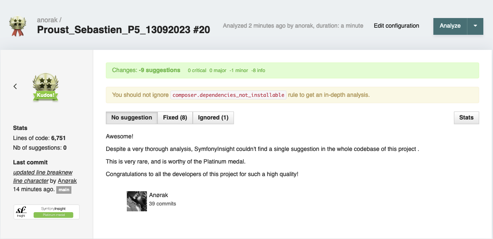
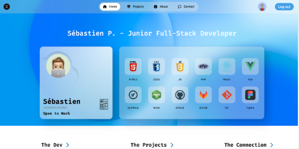

# Vanilla PHP Portfolio

## Description

This is a simple portfolio made with vanilla PHP, HTML, CSS and JS. Icons are from [Font Awesome](https://fontawesome.com/). UI/UX are
inspired by Apple IOS and iPadOS. Here is a list of the API used in this project:

1. [ipgeolocation.io](https://ipgeolocation.io/) to get the user's location.
2. [weatherapi.com](https://www.weatherapi.com/) to get the weather of the user's location.
3. [mapboxgl](https://www.mapbox.com/) to display an interactive map.

## Installation

1. Clone the repository
2. Go to the `config/config.js` and `config/config.php`and add your API keys:

-   `config/config.js`:
-   `mapboxgl.accessToken`
-   `config/config.php`:
-   `WEATHER_API_KEY`
-   `IPGEOLOCATION_API_KEY`

3. Setup your database in `config/config.php`:

-   `DB_HOST`
-   `DB_NAME`
-   `DB_USER`
-   `DB_PASSWORD`

4. Import the `src/lib/database/myblog.sql` file in your database.
5. Run `php -S localhost:8000 -t public` to start the server.

## Features

-   [x] Home
-   [x] Projects
-   [x] About
-   [x] Contact form
-   [x] Admin panel
-   [x] Login
-   [x] Register
-   [x] CRUD
-   [x] Newsletter
-   [x] Responsive design
-   [x] Weather
-   [x] Map

## Screenshots

## License

This project is under the MIT license. See the [LICENSE](LICENSE) file for more info.

## Author

-   [Github](https://github.com/Anoerak)
-   [LinkedIn](https://www.linkedin.com/in/s%C3%A9bastien-p-48717074/)
-   [Website](https://iamseb.dev/)
